# 镜头下的阿提卡监狱暴动

阿蒂卡监狱暴乱（Attica Prison riot）发生在1971年美国纽约州的阿蒂卡监狱。暴乱源于囚犯们要求更好的生活条件（这所被设计容纳1200名囚犯的监狱中住了2225人，同时囚犯只被允许一周洗一次澡，每人每月只有一卷厕纸可以使用。），以及回应当年8月21日黑人激进囚犯George Jackson被狱警枪杀于加州的圣昆汀监狱。1971年9月9日，近2200名阿蒂卡囚犯中大约1000名暴动并控制了监狱，将33名狱警作为人质。在接下来四天的谈判中，官方同意了囚犯的28条要求，但是没有同意对囚犯控制监狱和挟持人质在刑事指控上的完全赦免。在当时纽约州州长纳尔逊·洛克菲勒的命令下，州警察重新控制了监狱。暴乱结束后，至少39人死亡，包括10名监狱看守和文职人员。

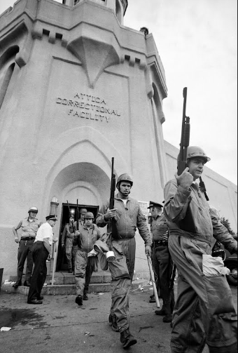

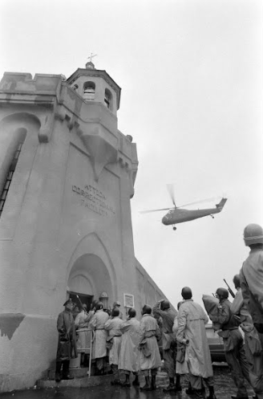

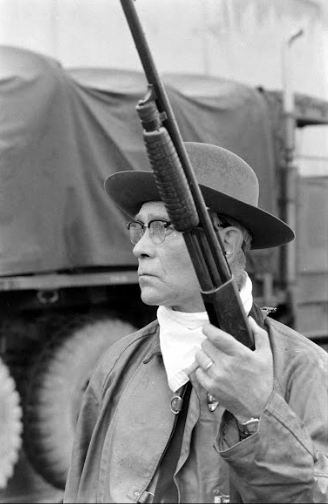

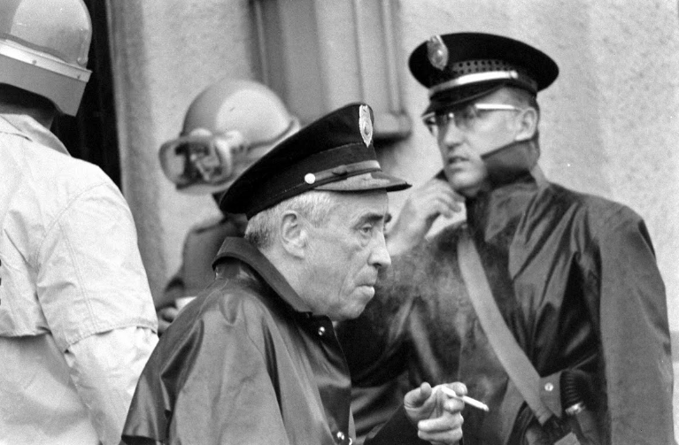

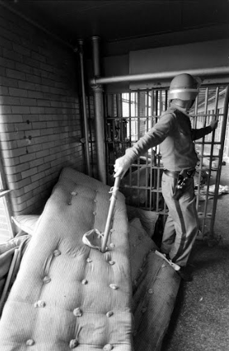

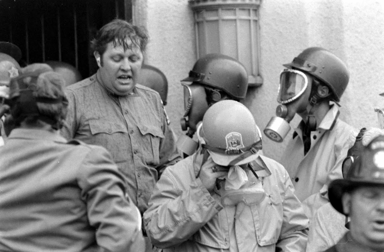

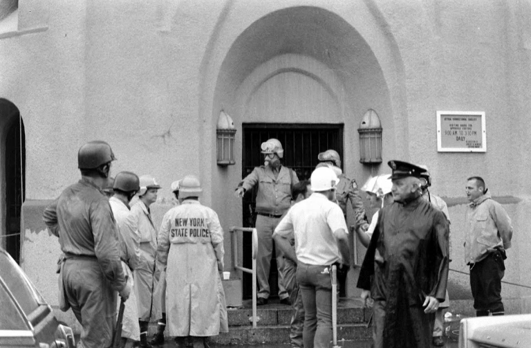

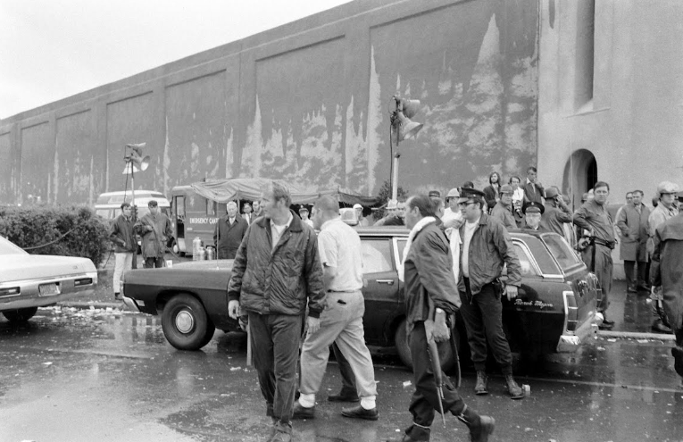

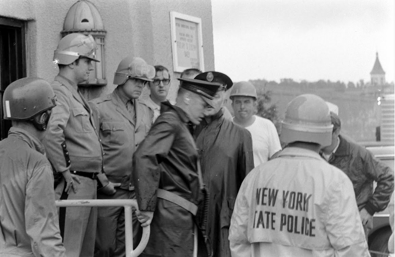

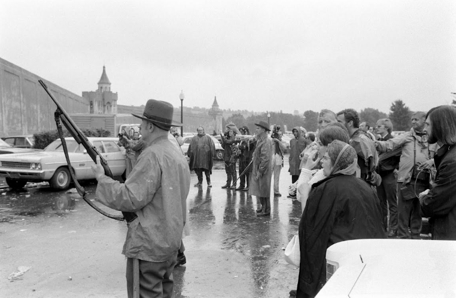

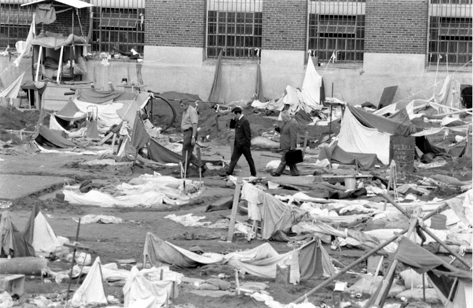

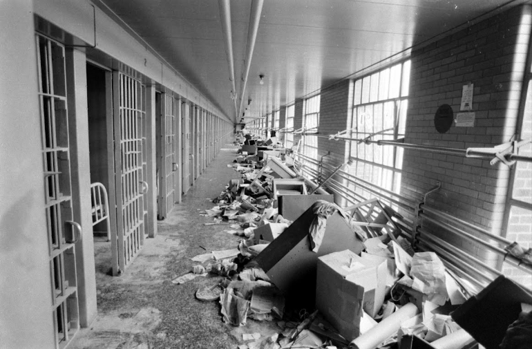

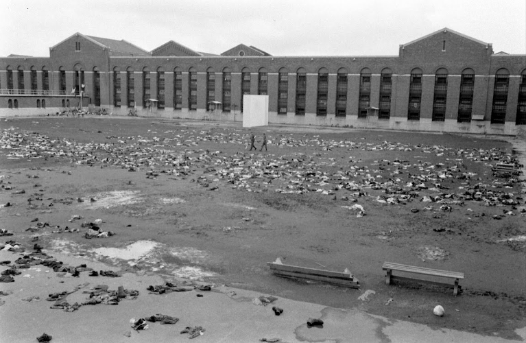

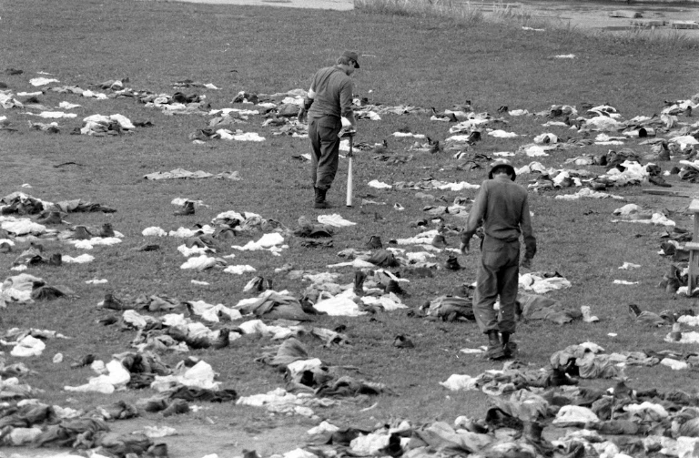

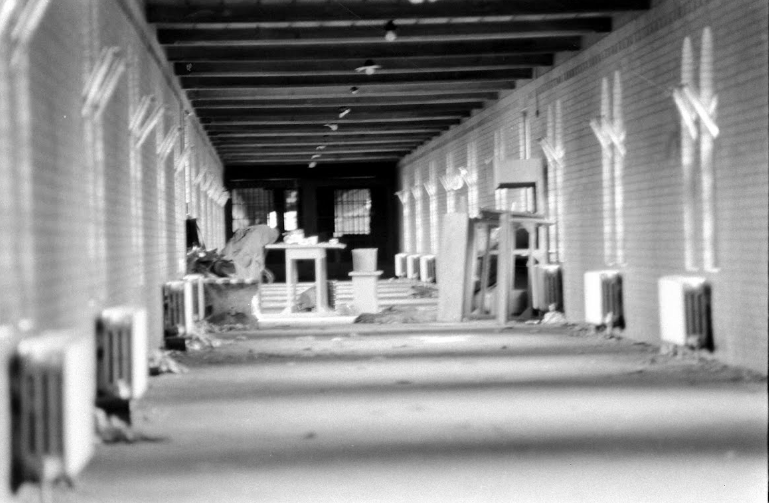

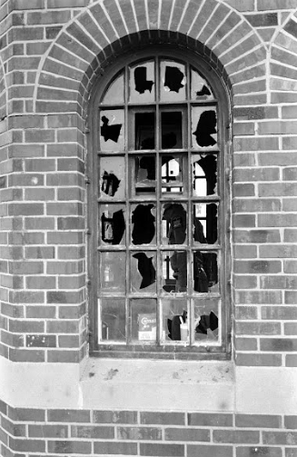

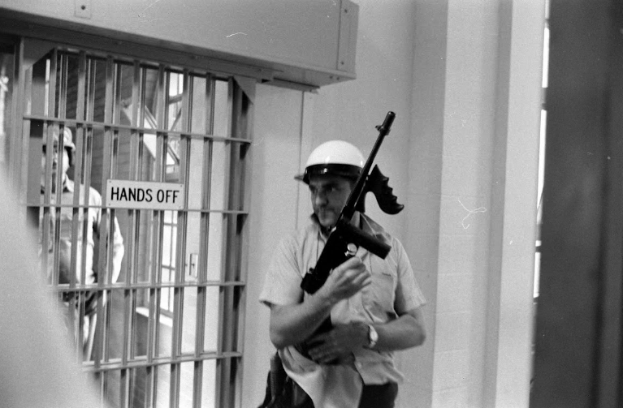

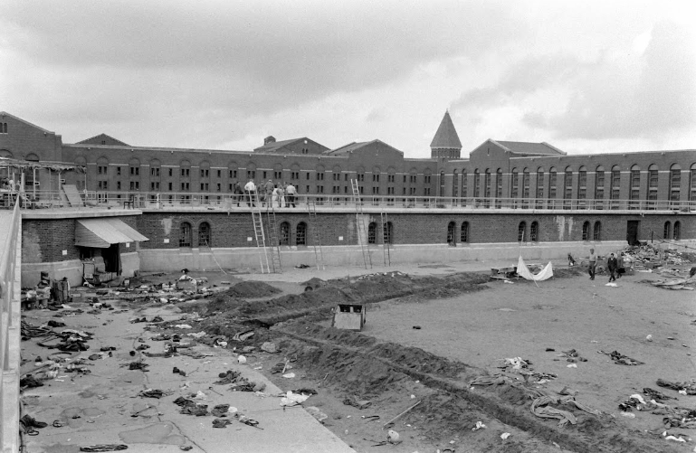

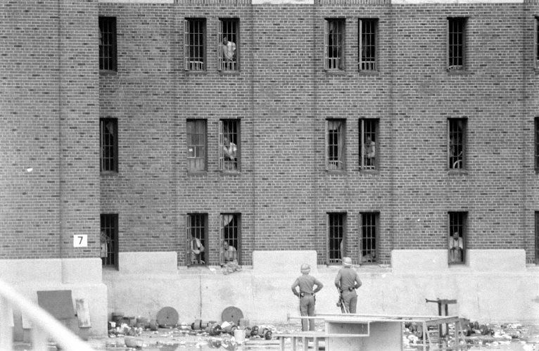

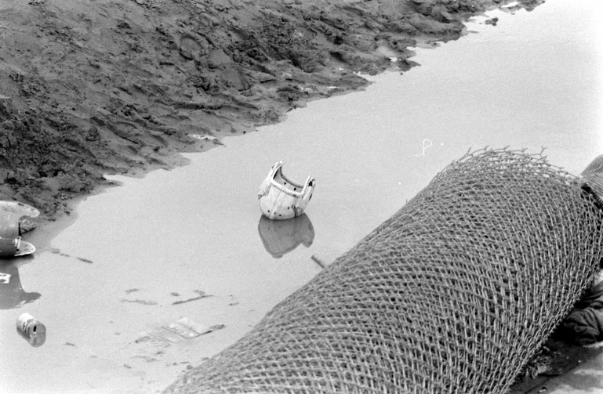

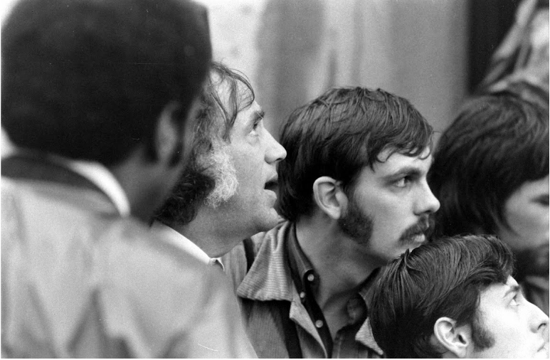

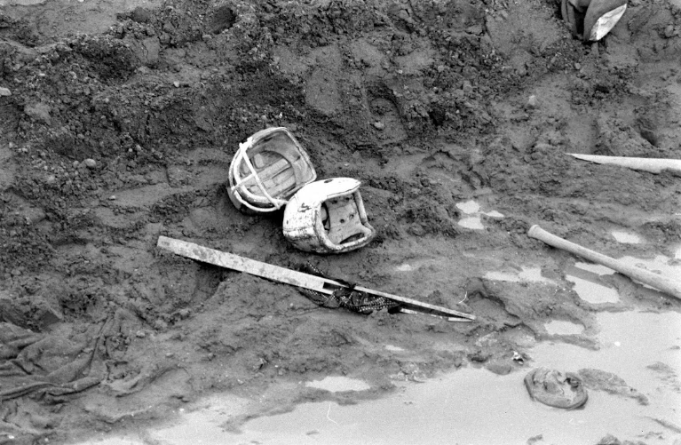

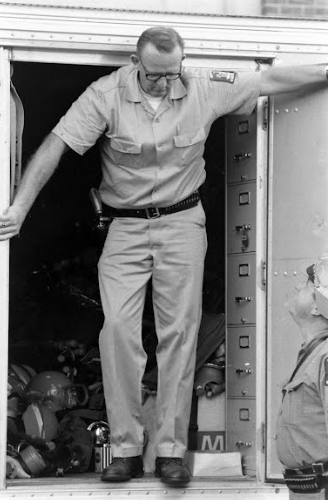

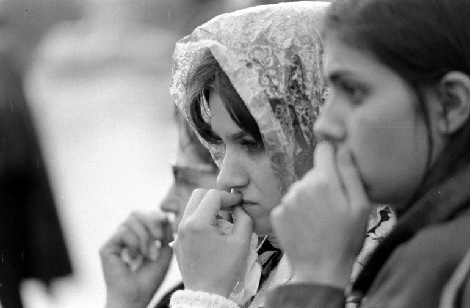

Photo by : 生活杂志摄影师John-Shearer

1971年9月9日，周四上午大约8点20分早餐时分，5队囚犯排队听到一个同伴因涉嫌攻击狱警被留在囚室中，将被拷打的传闻后，表示抗议，并设法将他从囚室中释放出来。一名狱警试图平复骚乱时，囚犯们的抱怨转变成了愤怒，打了这名狱警，暴乱由此开始。

囚犯迅速控制了监狱D区以及中心控制室和广场。将42名监狱看守和文职人员作为人质并将他们的要求写成了一份清单，声称只有在要求被满足后他们才会停止暴动。

纽约州州长纳尔逊·洛克菲勒拒绝到暴乱现场和囚犯见面，囚犯一方面和矫正服务部门专员罗素·奥斯瓦尔德进行艰难的谈判，一方面和包括了《纽约时报》编辑汤姆·威克，《密歇根纪事报》的詹姆斯·英格拉姆，纽约州参议员约翰·邓恩，纽约州众议员阿瑟·伊夫，公民权利律师威廉·孔斯特勒，伊斯兰民族组织代表路易斯·法拉堪和其他代表的观察团进行协商。

谈判最终破裂，奥斯瓦尔德告诉囚犯他无法再和他们谈判并且要求他们投降。他之后打电话给纽约州州长纳尔逊·洛克菲勒再一次请求他到监狱。被州长的拒绝后，奥斯瓦尔德表示他将命令州警察用武力重新取得监狱控制权。州长纳尔逊·洛克菲勒同意了奥斯瓦尔德的决定。这个决定之后受到了纳尔逊·洛克菲勒建立的阿蒂卡监狱暴乱及后果调查委员会批判。

犯人们的情绪变得越发躁动不安，他们挖好了壕沟，将金属大门通上电并且用桌子和土筑起了堡垒。汽油也准备好等待在冲突爆发的时候被点燃，而监狱庭院的控制中心也加强了防守。囚犯们将四名矫正官员带到了控制中心的顶层，并威胁要割断他们的喉咙。直升机上的记者报道称在D区的人质也将要被处决。州长纳尔逊·洛克菲勒下达了命令，如果谈判破裂，在当天就要夺回监狱的控制权。指挥官奥斯瓦尔德在看到了人质面临的危险后下令用武力夺回监狱。对于这个决定，他在之后回忆到说：“我想我在一个相对小的多的规模上知道了杜鲁门当年决定投下原子弹时是怎样想的。”

1971年9月13日星期一早上9点46分，催泪瓦斯被扔进监狱中，同时来自纽约州的警察和来自纽约国民警卫队的士兵在烟雾中进行了持续两分钟的开火。他们使用的武器包括霰弹枪，这造成了人质以及没有反抗的囚犯的死伤。在这次行动中，监狱原先的矫正官员也被允许参加，这被后来由纳尔逊·洛克菲勒建立的暴乱及后果调查委员会认为是一项“不可饶恕”的决定。到监狱被夺回时，有9名人质以及29名囚犯被杀。十分之一的人质由于在冲突中受到枪伤并于1972年10月份死去。

最终死亡人数中还包括在暴乱开始时受重伤的狱警，另外总共有9名人质死于警察和士兵射击。纽约州阿蒂卡特别委员会写道：“除了19世纪的印第安大屠杀，这场结束了持续4天监狱暴动的纽约州警察进攻造成了美国自内战以来最为血腥的一天。”
