# 克劳迪·斯鲁本摄影作品

​1995年，法国摄影师克劳迪·斯鲁本（klavdij sluban）在弗勒里-梅罗吉的青少年监狱设立了一个专为犯人开办的摄影学习班。教授他们拍摄以及洗印照片。他们的作品在监狱里定期展出。卡蒂埃-布勒松在这个项目开始的时候一年要去好几次，威廉·克莱因和马克·吕布也到过那里给予他们鼓励。2000年，他在斯洛文尼亚的Celje的青少年监狱，成立了另一个摄影学习班。随着这些项目的开展，他开始在前苏联地区的年轻犯人中间进行类似的摄影交流。

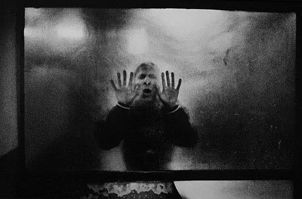

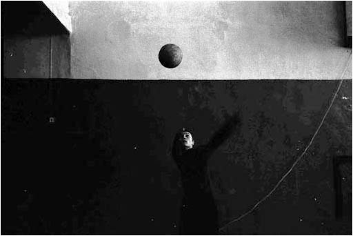

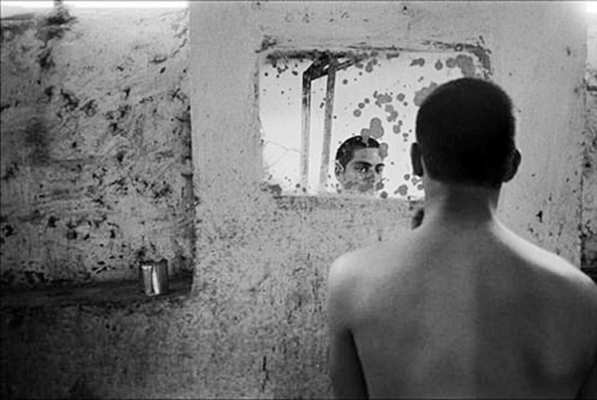

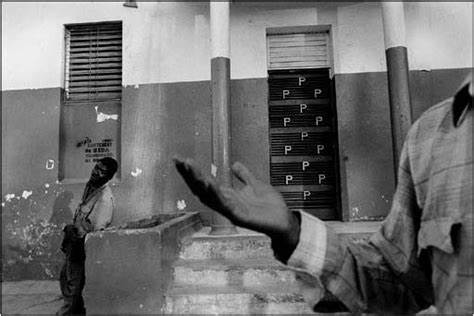

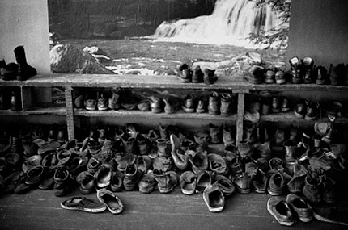

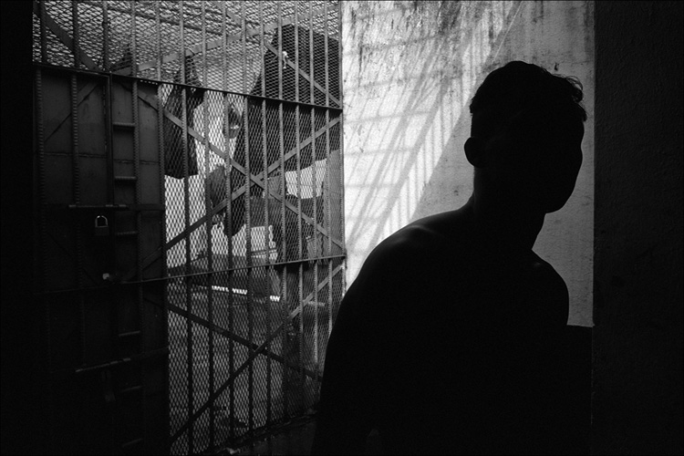

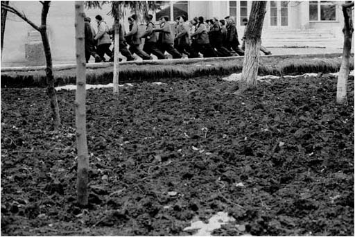

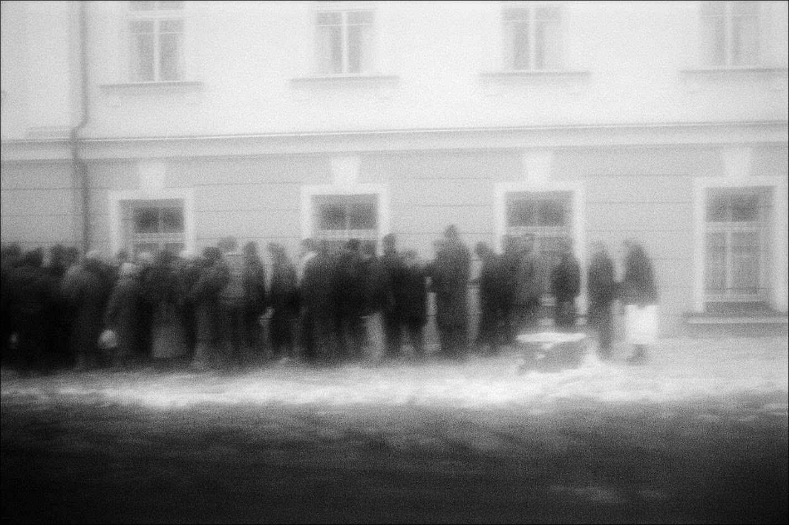

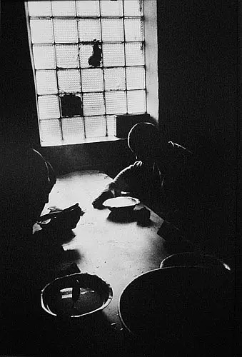

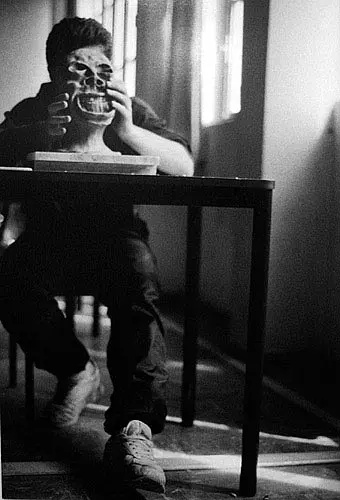

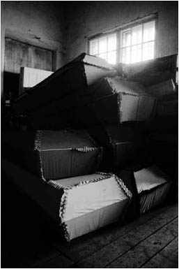

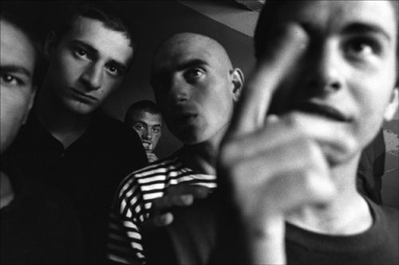

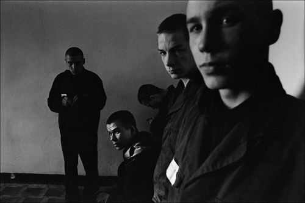

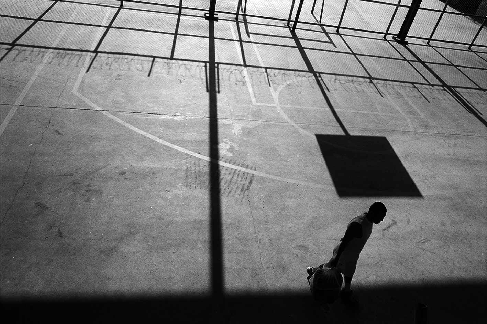

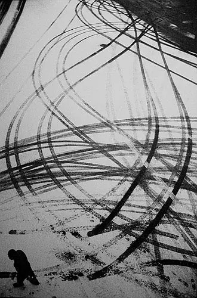

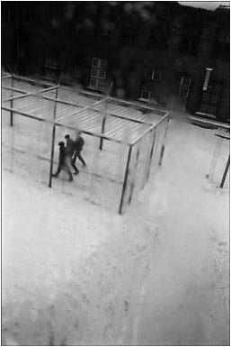

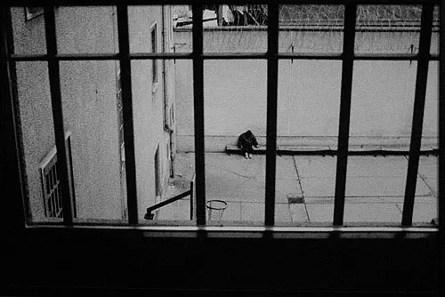

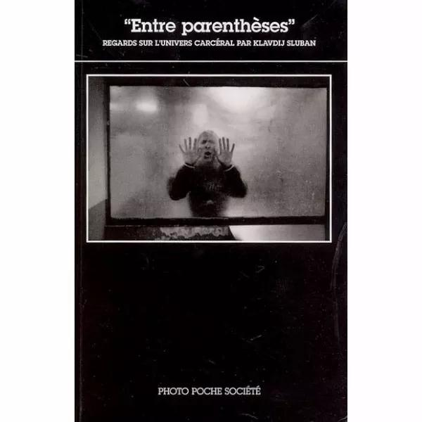

克劳迪·斯鲁本1963年出生于巴黎，父母为斯洛文尼亚移民，斯鲁本的儿童时代在斯洛文尼亚度过。在法国接受小学和中学教育。从少年时代就酷爱摄影，14岁开始拍照，曾在法国黑白暗房大师乔治·费弗尔的暗房学习，曾游历过全世界许多地方。1986年获得英美文学硕士。回到巴黎之后，他成为一名英语教师，后又移居斯洛文尼亚的乡村。1992年，他回到法国，全身心地投身到摄影，不断到巴尔干、黑海地区、前苏联、日本、加勒比地区、耶路撒冷和波罗的海旅行。

斯鲁本2000年获得最有声誉的Niepce大奖和2004年莱卡优秀奖牌，作品在世界各地展览中展出，曾被法国国家图书馆、欧洲摄影之家、水之堡摄影博物馆、东京大都会摄影博物馆等机构收藏。03年,斯鲁本参加了平遥国际摄影节，2006年广东美术馆就为他主办了大型回顾展。

斯鲁本主要作品：《巴尔干——穿越》，《环绕黑海——冬日旅行记》，《今日东京》，《失落的天堂》，《耶路撒冷》，《其他海岸——环绕波罗的海》，《法国和前苏联的被拘留青年》。
