# 马格南摄影师亚历克斯·马约利作品选

​亚历克斯·马约利（alex majoli）是一位意大利摄影师，以记录战争和冲突而闻名。他是马格南图片社的成员。

  
阿富汗喀布尔，一名北方联军战士看管巴基斯坦和塔利班犯人

  
喀布尔中央警察局（马累科），这个人叫阿赫拉，他和他爱的女人因通奸受审，他们仍在监狱里服刑。

  
阿赫拉的爱人费里巴

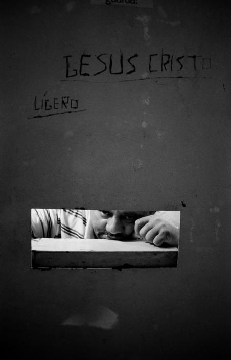  

  
巴西圣保罗，卡兰迪鲁监狱娱乐室。1997年

  
巴西圣保罗，卡兰迪鲁监狱。1997年

  
圣保罗卡兰迪鲁监狱。一个被称为大黄色的隔离室，只有透过高高的窗户才能看到太阳。1997

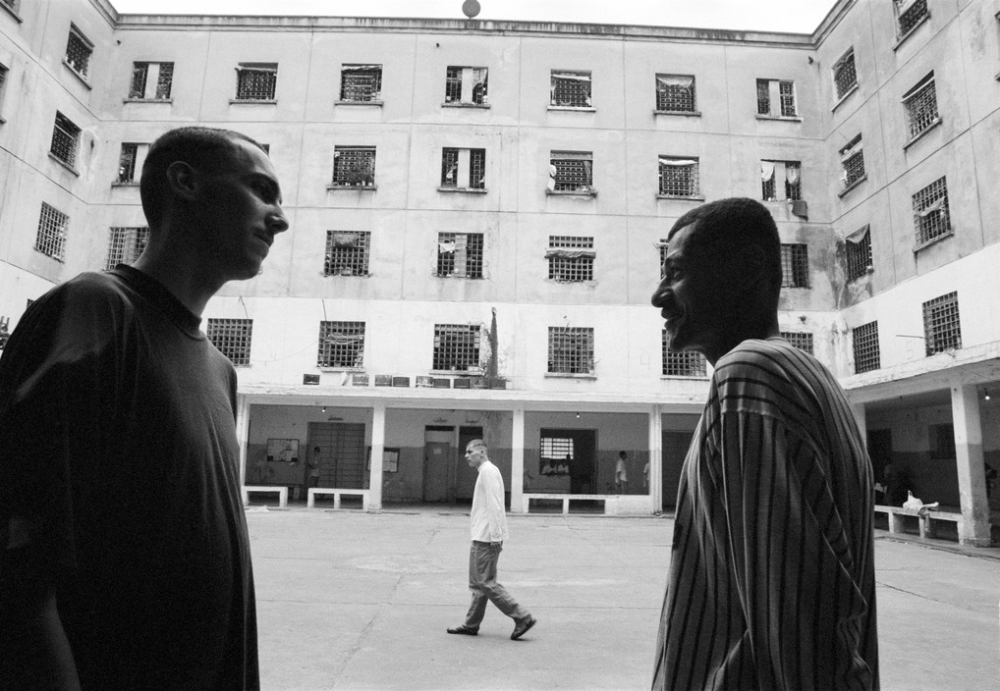

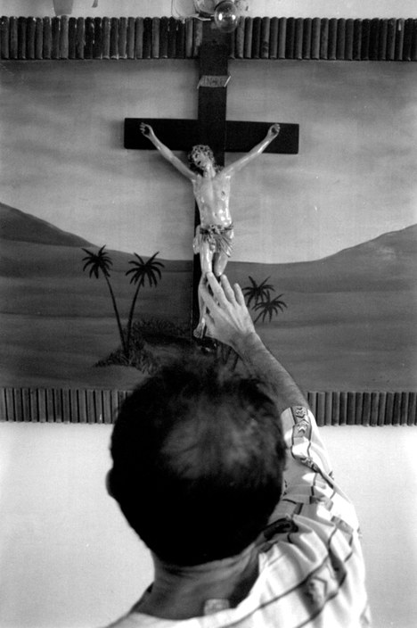

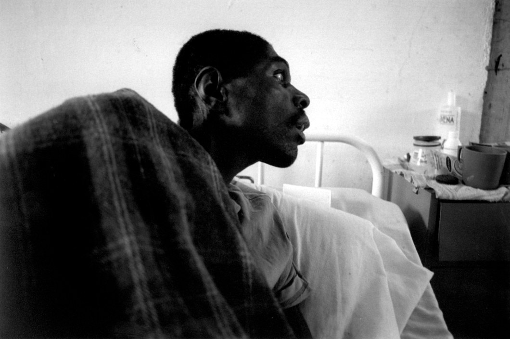

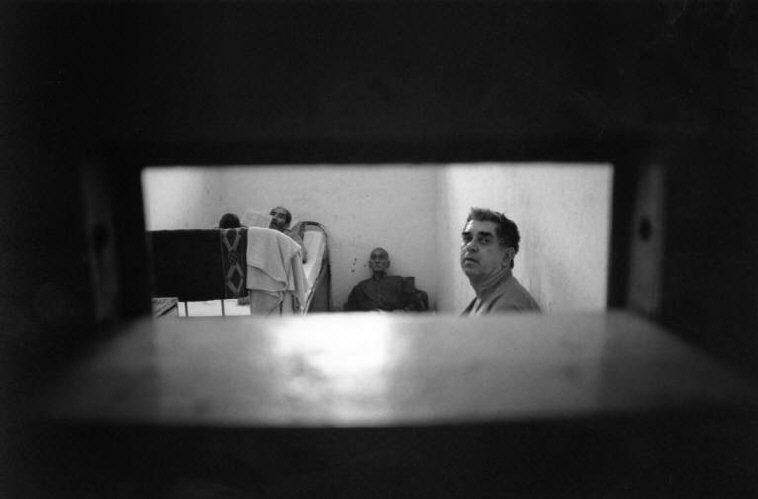

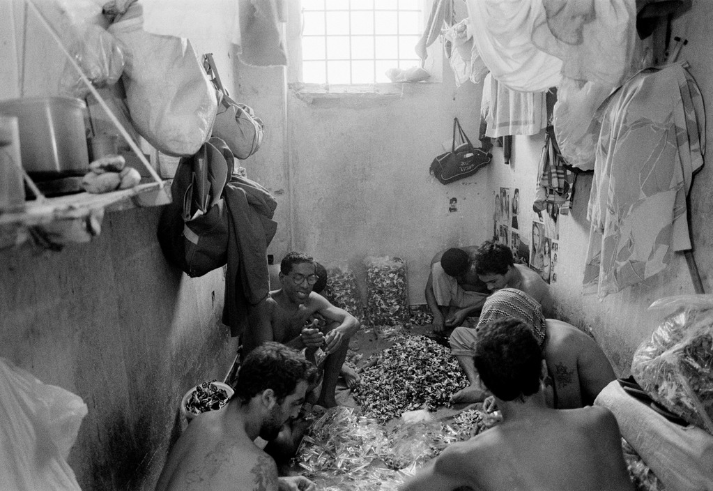

  
卡兰迪鲁监狱。许多犯人在拳击馆里消磨时间。这个人是圣保罗州拳击冠军。1997年

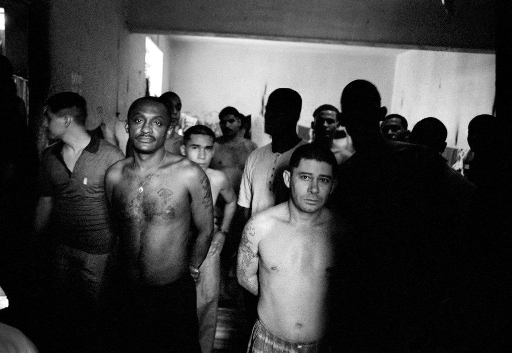

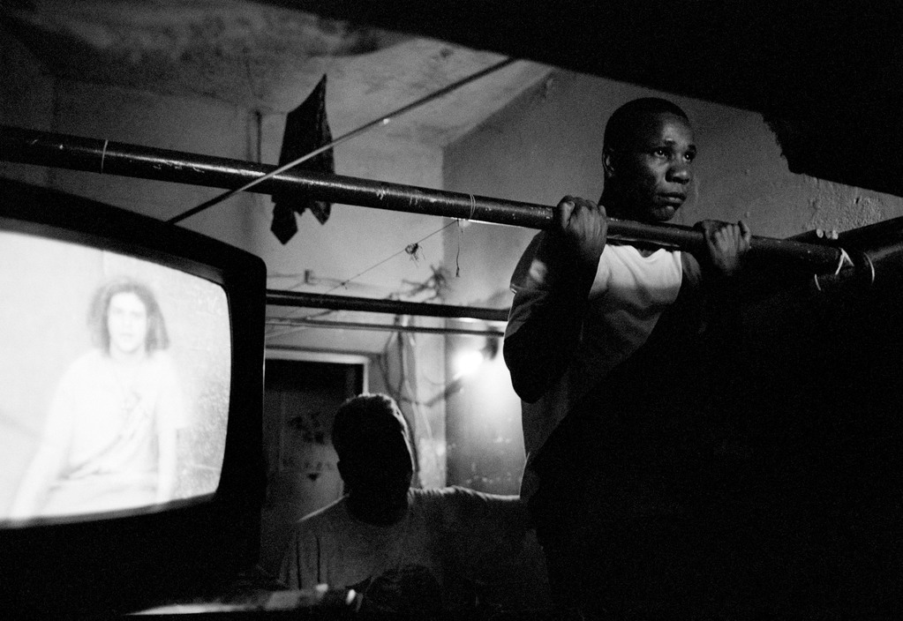

  
卡兰迪鲁监狱囚室里的囚犯。1997年

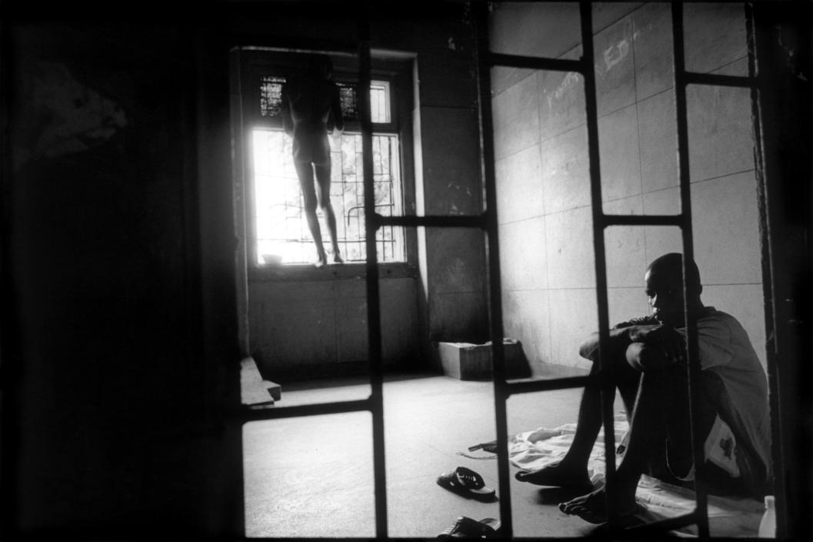  
安哥拉，被关在精神病院的病人。2000年

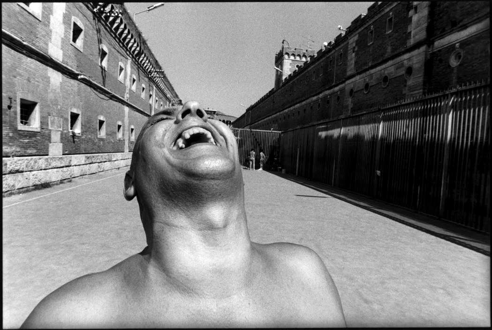  
意大利沃尔泰拉，监狱剧场的一位演员。1996年

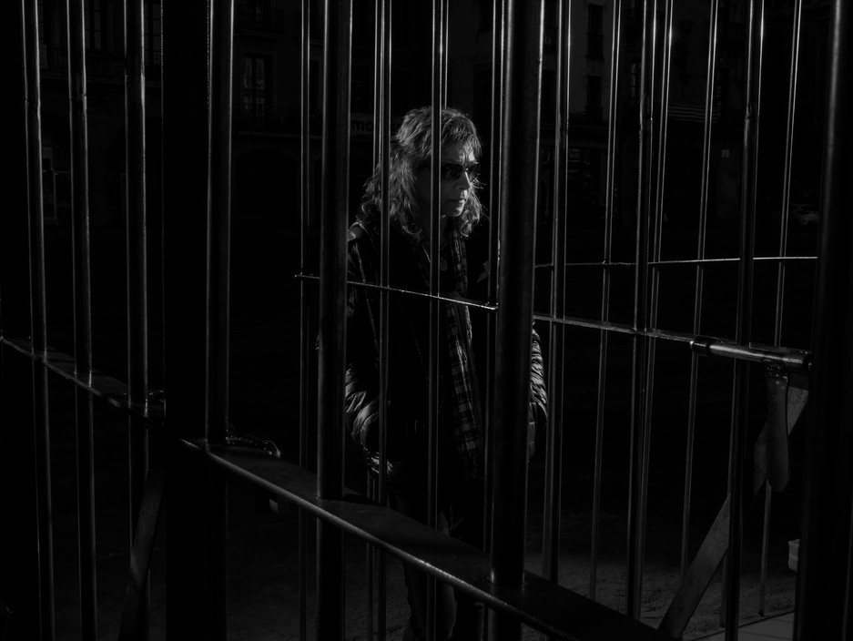  
2017年，奥姆尼姆文化组织为了抗议政府关押加泰罗尼亚领导人，在加泰罗尼亚中部城市维克的城市广场设立了两个牢笼，组织志愿者自我囚禁，每12个小时换一次人。150多名志愿者参加此次活动。

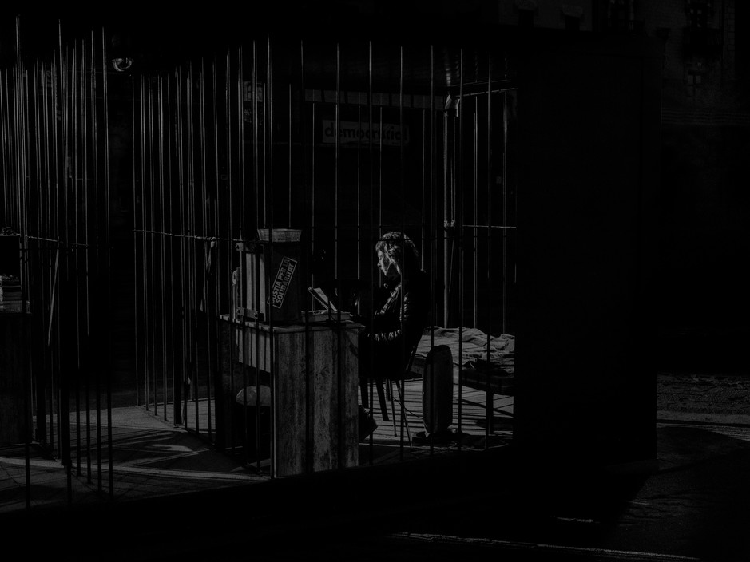  
