# 马格南摄影师Jean Gaumy作品

​1976年开始，摄影师Jean Gaumy拍摄法国四所监狱，1983年出版摄影集《Les Incarcérés》。

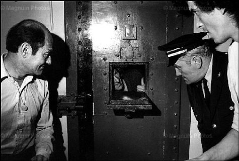

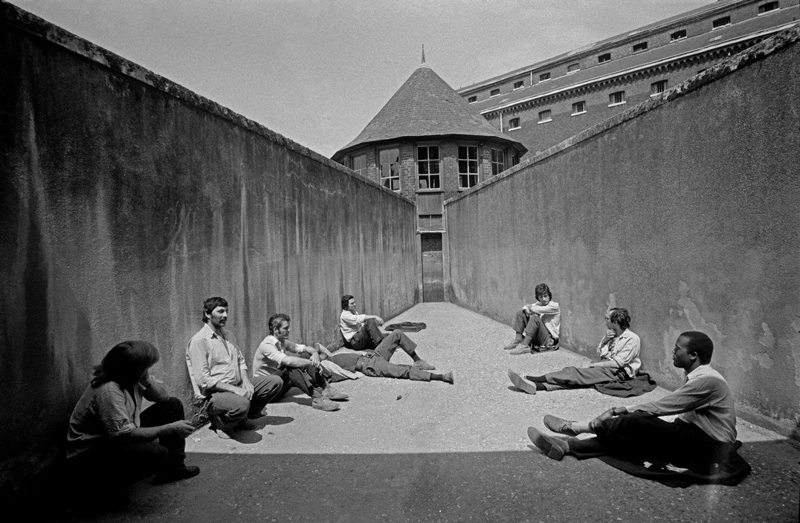

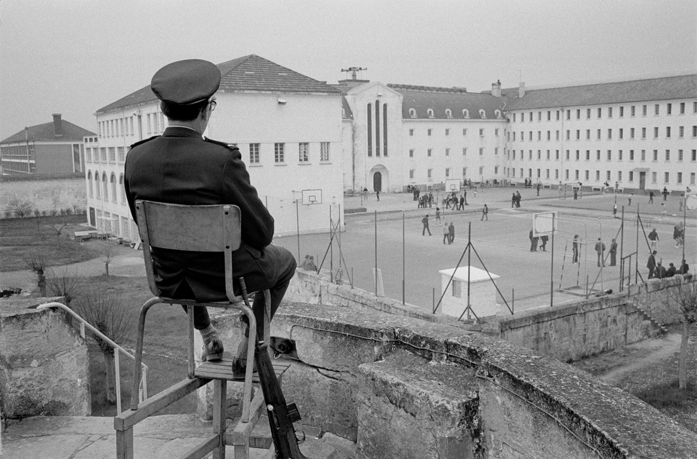

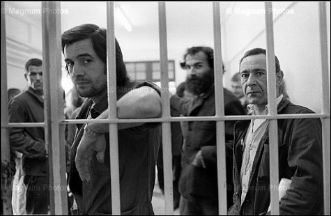

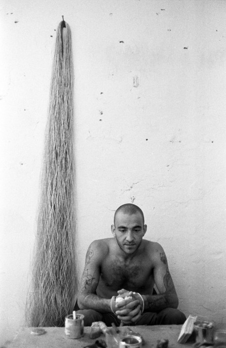

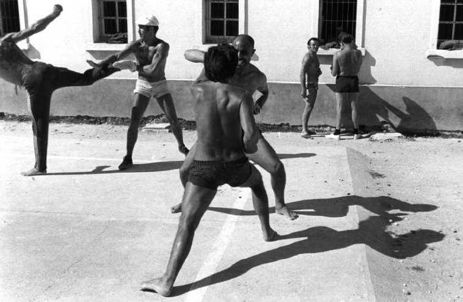

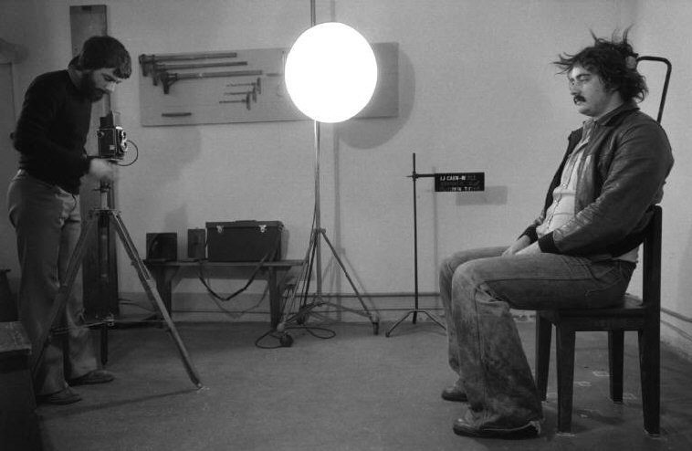

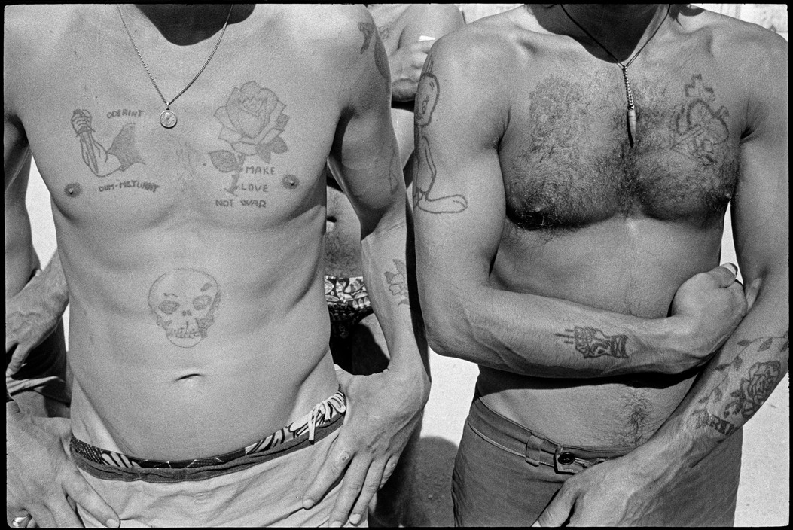

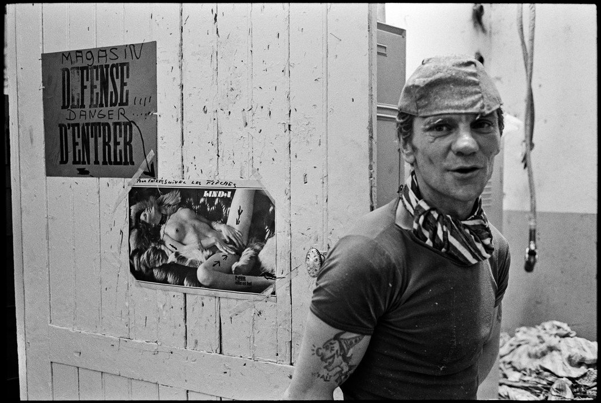

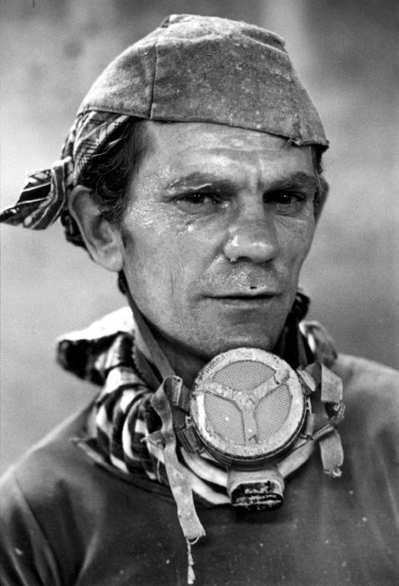

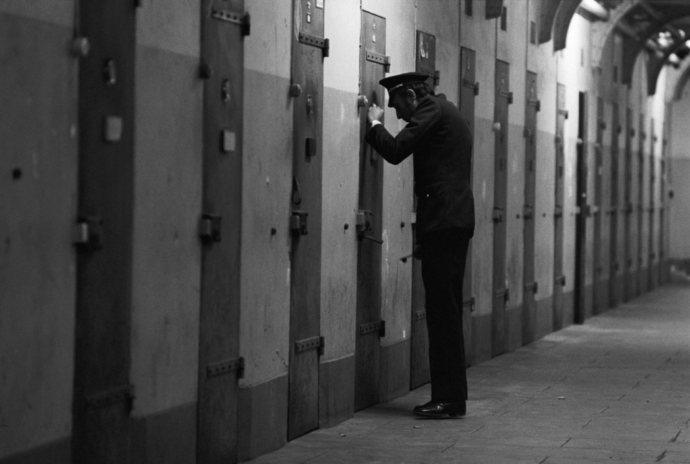

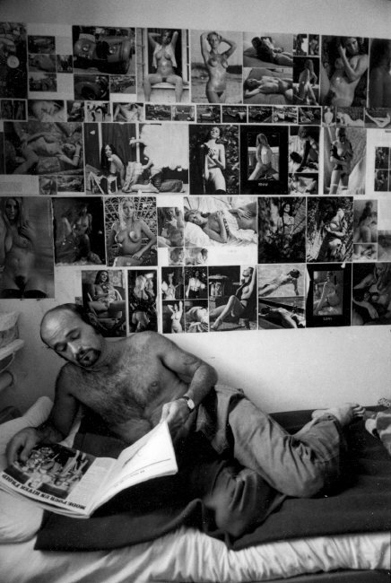

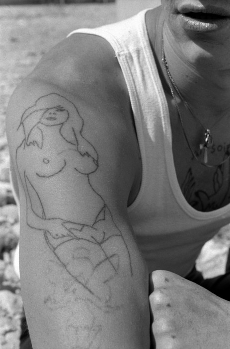

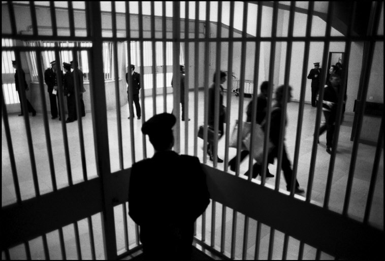

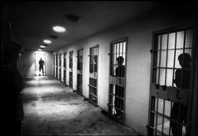

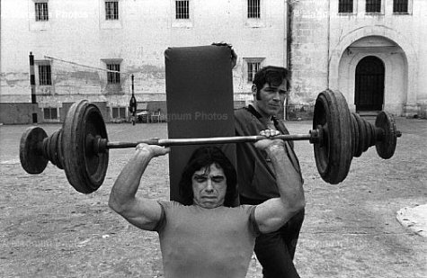

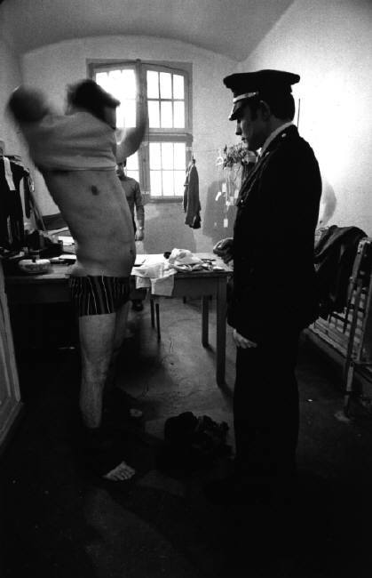

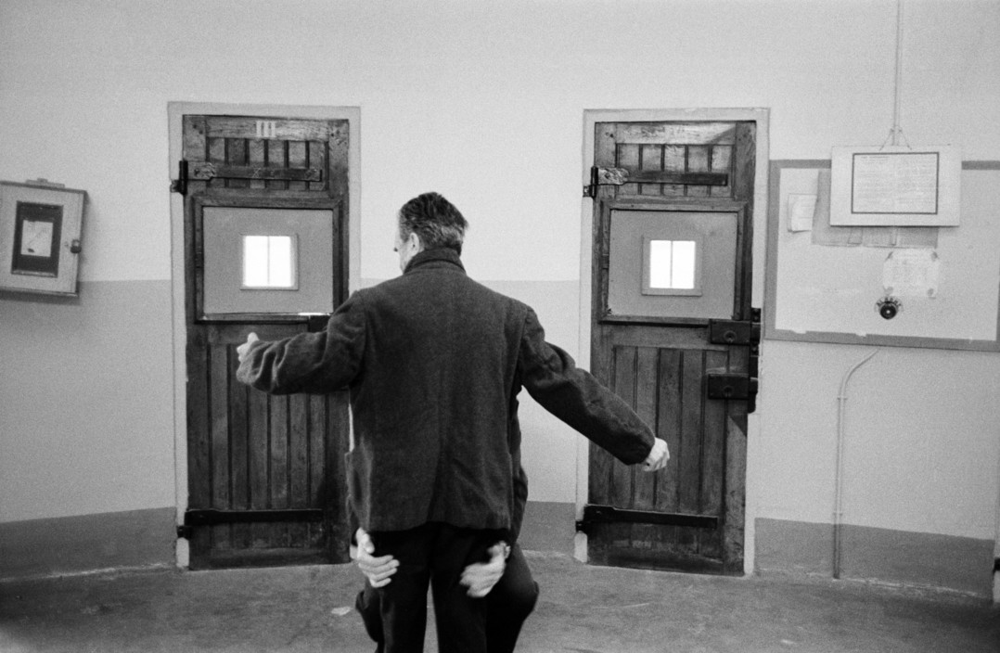

  
监狱图书馆

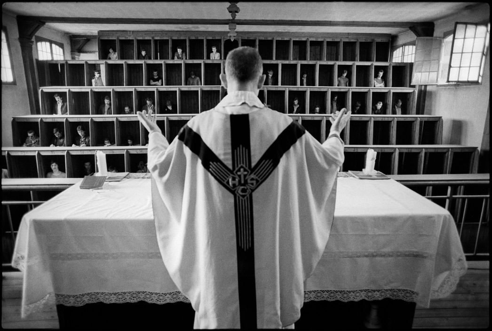  
监狱教堂

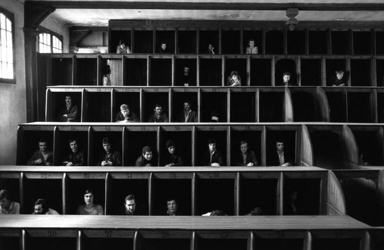  
格子里的犯人

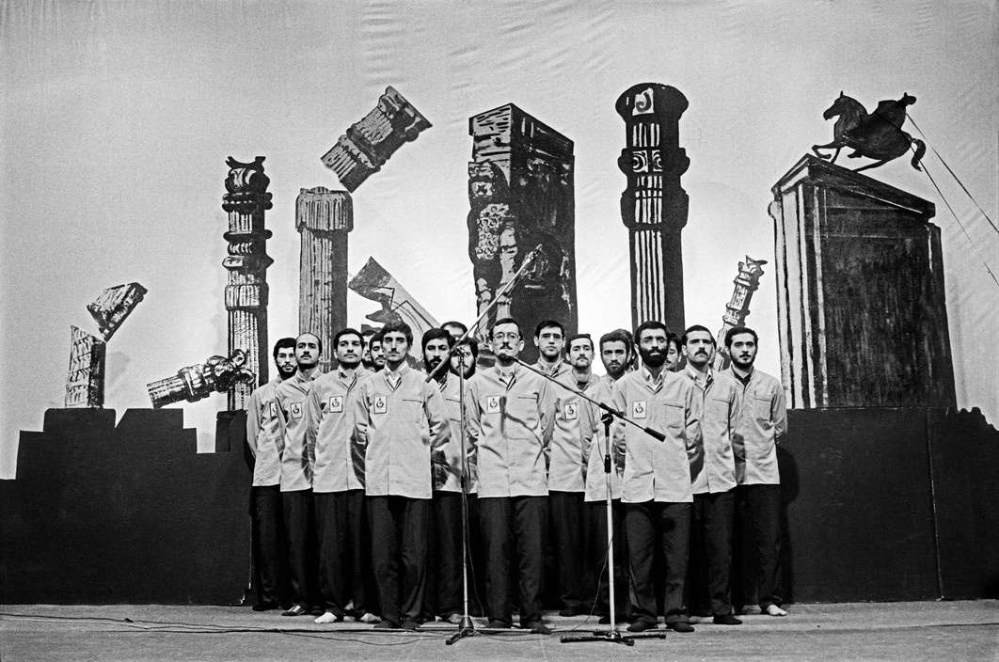  
1986年拍摄的伊朗囚犯合唱团

  
自由

Jean Gaumy，1948年出生于法国Pontaillac。  
1973年受Raymond Depardon的邀请加入French Gamma。  
1975年，他在法国跟踪拍摄了项目：  
1.“L‘Hopital”1976年出版；  
2.1976年在法国监狱拍摄的“Les Incarcérés”，1983年出版。

1976年与Marc Riboud 和Bruno Barbey结识，1977年加入了马格南图片社。  
1984年，拍摄了他第一部电影“La Boucane”，并在1986获得凯撒最佳纪录片提名。  
同年，他乘坐一艘“经典”号捕鱼船开始了一个海上环游的项目，这个项目一直持续到1998年，并在2001年出版了《Pleine Mer》。

从1986年两伊战争开始，到1997年，前后三次前往伊朗。  
1987年，花了2年时间拍摄了电影《Jean-Jacques》，记录他居住的Octeville-sur-Mer镇。  
1994年，在Raulhac, Cantal和Auvergne花了几年时间拍摄个人第三部电影 《Marcel, prêtre》，2001年获得Nadar大奖。

2005年，花4个月的时间在海地拍摄了与核潜艇相关的电影《Sous Marin》。  
2008年开始，从北冰洋到切尔诺贝利拍摄。同时，也拍一些景观类照片。  
2010年他凭借着他的书 《D'après Nature》"第二次获得Nadar大奖。  
同年，开始致力于拍摄一些类似于核潜艇的核威胁的照片。  
2012年早些时候，他去了福岛，后又去了北冰洋。
