# 监狱里的女性

​1908年，出狱的英国女性选举权之母艾米琳·潘克赫斯特（Emmeline_Pankhurst）与女儿克里斯塔贝尔（Christabel）展示自己坐牢时穿的囚服。她为争取女性选举权多次坐牢并绝食，进行激烈的斗争，终于在1918年成功为英国女性争取到选举权。随后，美国于1920年承认妇女投票权。

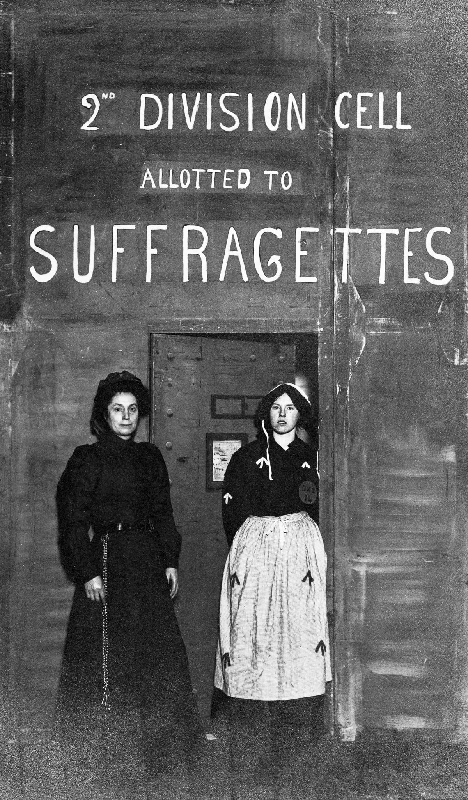  
1908年，大量女性在潘克赫斯特夫人感召之下自愿入狱。

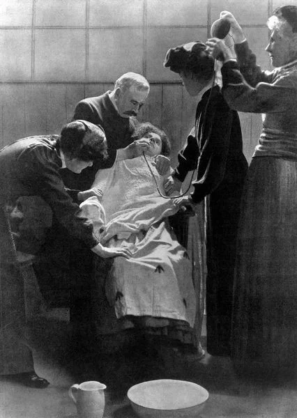  
狱方对绝食女性进行强制喂食

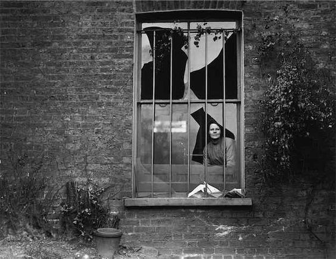  
1913年，一位女士从伦敦霍洛威监狱（Holloway）一扇破碎的窗户往外看。

  
20世纪初，巴黎著名交际花marguerte steinheil在回忆录中展示她被控谋杀入狱时的日用品，包括：自制拖鞋、硬币打磨的镜子、自制面包篮、自制的咖啡滤网、钝刀以及杯子。

  
1945年，一名刚被美军从德国瓦尔德海姆监狱中解救出来的荷兰妇女

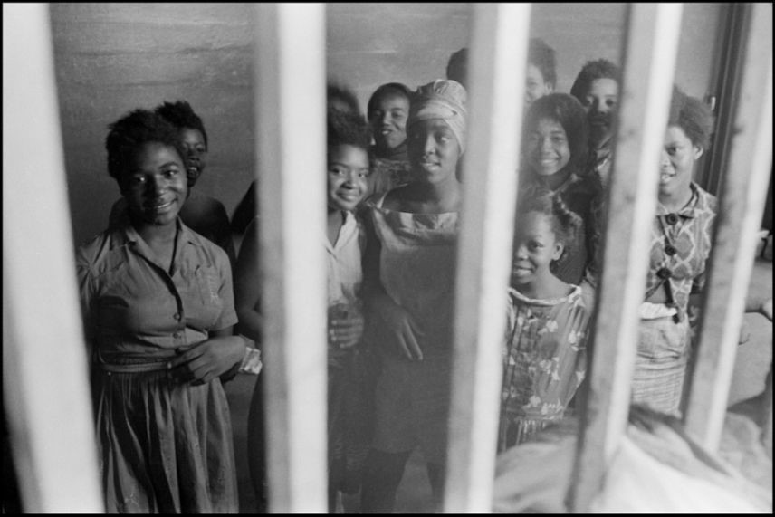  
1963年，美国佐治亚州  因参加黑人平权运动被捕的少女们   Danny Lyon摄

  

  

  
1963年，leonard freed在美国新奥尔良女子监狱拍摄的白人监区

  
美国南部几个州的监狱都有牛仔比赛，路易斯那安州和阿拉巴马州等地都有女犯人参加牛仔比赛。

  
1989年开始，摄影师Jane Evelyn Atwood历时十年走访了九个国家四十多所监狱，2000年出版摄影集《too much time》。监狱摄影｜Jane Evelyn Atwood作品

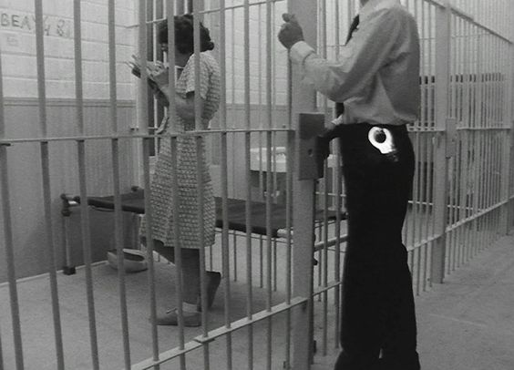  
Tony Conrad拍摄的女犯人  1982

  
英国  Chris Steele-Perkins  1986年

  
俄罗斯女子监狱 Chris Steele-Perkins 1988年

  
路易斯安那州圣加布里埃尔（St. Gabriel）女子监狱 美国摄影师deborah luster拍摄 1998.

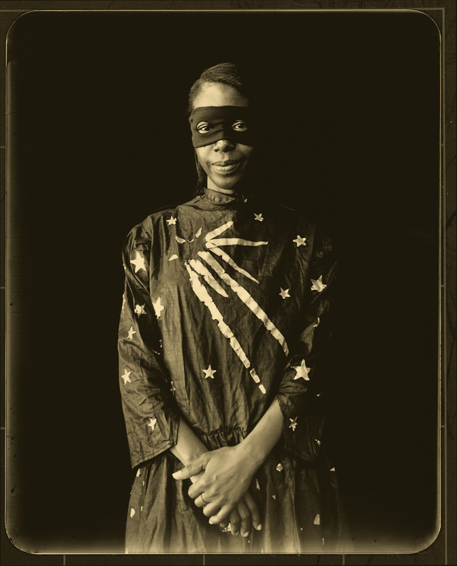  
拍完后，她会给犯人一张可装进钱包的相片拷贝，关于这组照片更多信息：监狱书系｜诗歌与摄影集《大写的我》

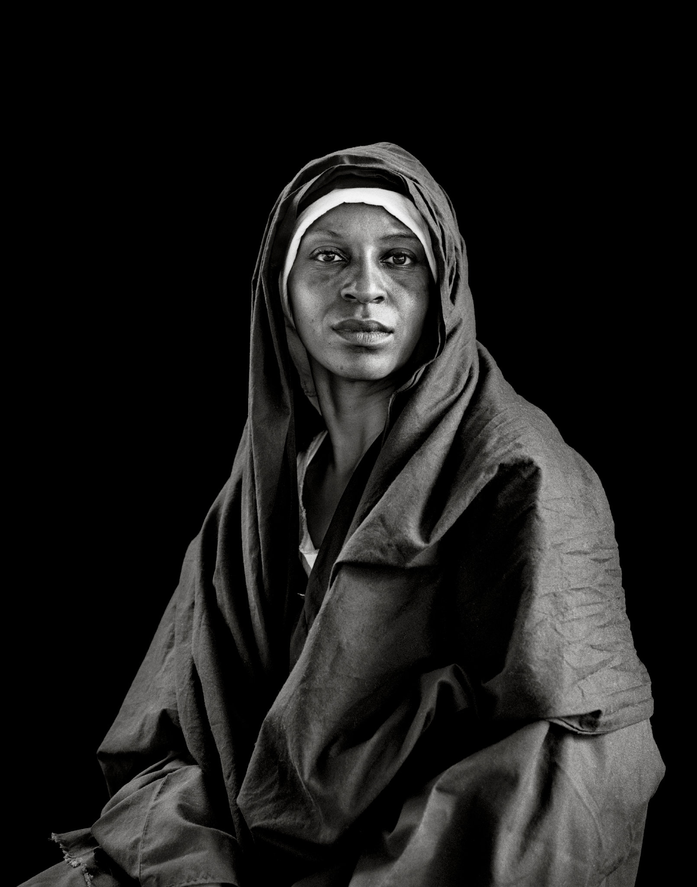  
2012年和2013年，美国路易斯安那州安哥拉监狱的监狱剧团在该监狱运动场上演了戏剧《耶稣基督的一生》 (The Life of Jesus Christ)，该剧共由70名犯人参演，还有一头驴，两匹马，一头骆驼。女性角色则来自圣加布里埃尔（St. Gabriel）女子监狱，这位女士名叫安娜，她饰演玛利亚。耶稣由一名抢劫犯饰演。这是Deborah Luster为她们拍的定妆照。

  
michelle allen饰演女麻风病人

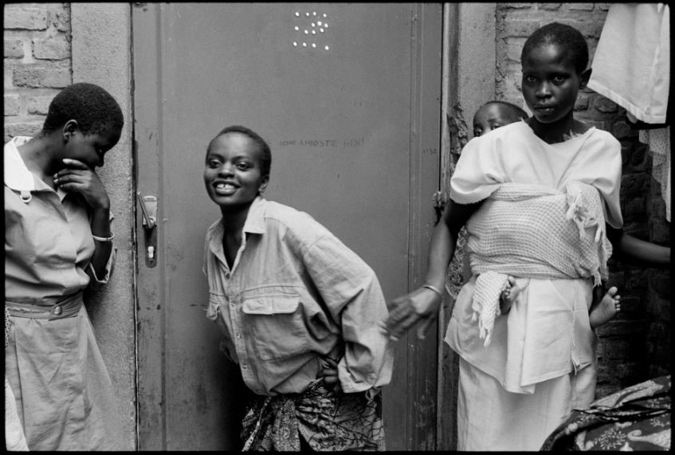  
卢旺达  Raymond Depardon摄  1994年

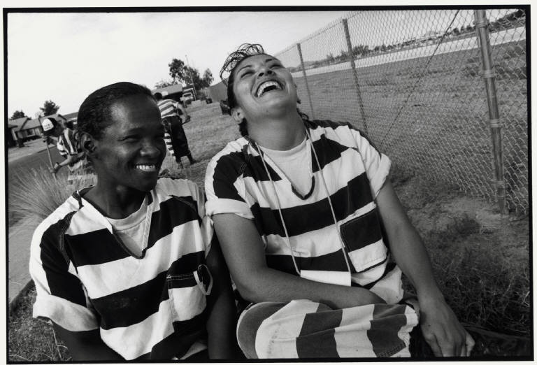  
美国  Eli Reed摄  1998

  

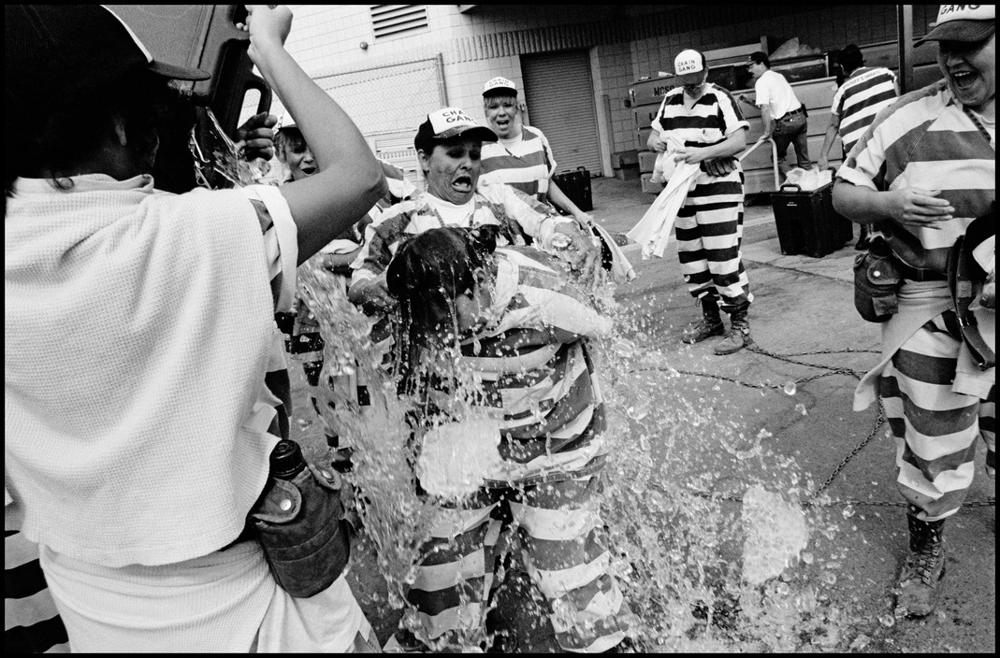  
冰桶挑战

  

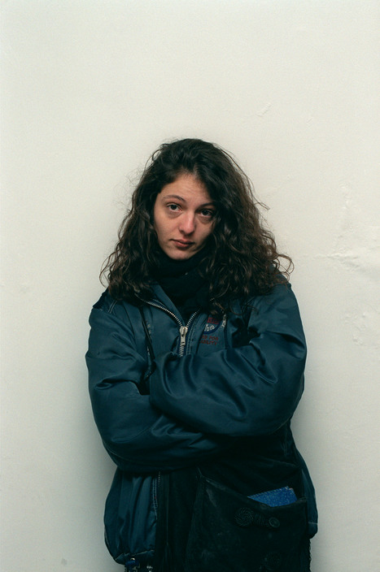  
阿根廷  被关押的Ngo组织hijos成员 Patrick Zachmann摄 1999年

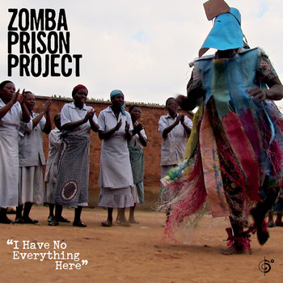  
非洲最贫困的国家之一马拉维的监狱里，犯人们的音乐入围2016年格莱美音乐最佳世界专辑提名，并于2015年、2016年出版了两张专辑。更多关于宗巴音乐项目：Zomba Prison Project(宗巴监狱项目)

  

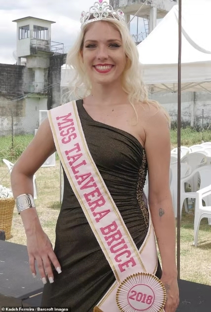  
好几个国家都会举办监狱选美大赛，如巴西、哥伦比亚、墨西哥、俄罗斯、菲律宾等，这位女士获得了2018年巴西监狱选美冠军。

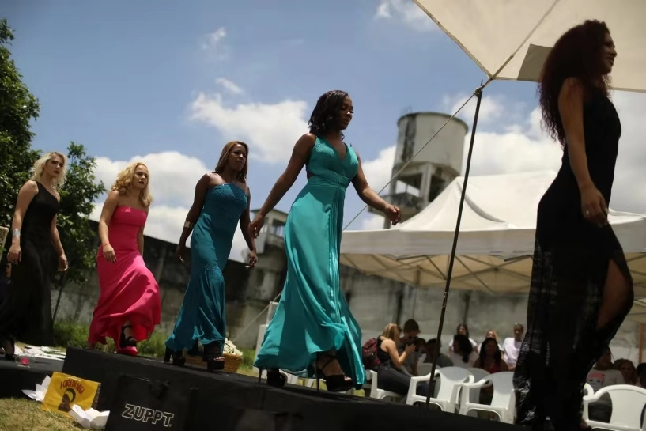

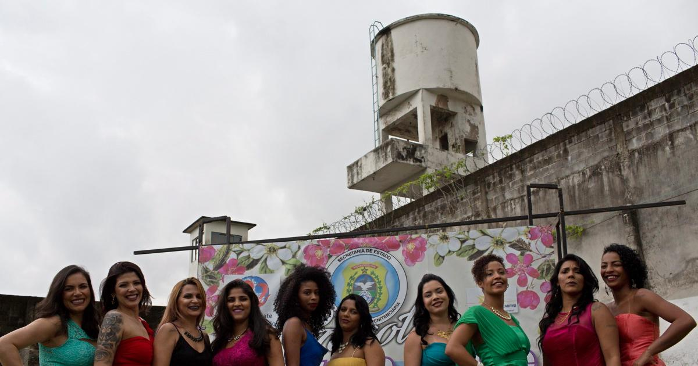

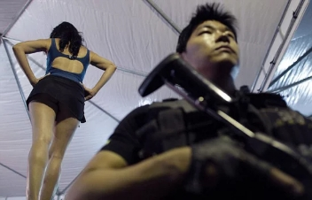

  
墨西哥监狱选美大赛

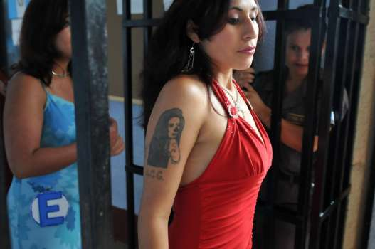

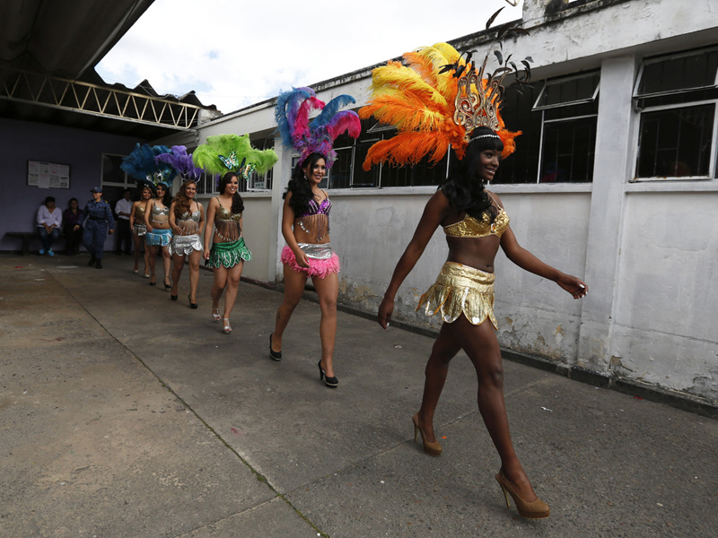  
哥伦比亚监狱选美

  
俄罗斯监狱选美

  
美国雷克斯岛监狱（rikers），Lucas Foglia拍摄的做园艺的女犯们

  
墨西哥女摄影师帕特里夏·阿里吉斯（Patricia Aridjis）投入七年时间拍摄名为The Black Hours 的项目，在墨西哥的SantaMarthaAcatitla、Tepepan、Reclusorio Norte＆Oriente和Michoacan四所监狱记录被监禁的女性。Patricia Aridjis更多监狱摄影作品：帕特里夏·阿里吉斯监狱摄影作品

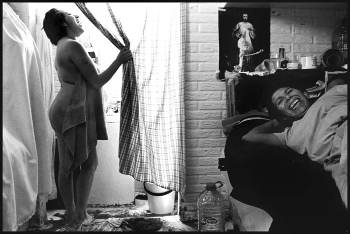

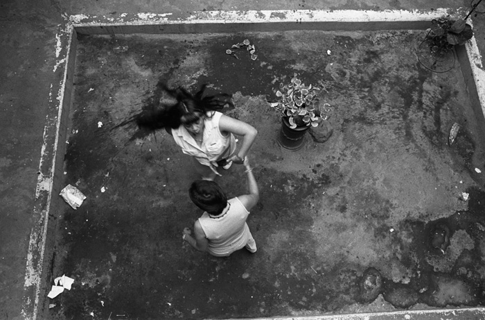

  
美国  Jim Goldberg摄  1991

  
 祝人人自由且丰盈！
