# 监狱里的精神病患者

​2008年冬天美国摄影师詹妮·阿克曼（Jenn Ackerman）在在肯塔基州惩教所对被监禁的精神病患者进行了为期10周的拍摄。

“我想展现我所看到的绝望、敌意以及脆弱。”

“第一次走进这里，我就听到痛苦的嘶喊、尖叫、哭泣和敲打撞击的声音。我看到一个人蹲在角落里哭，另一个人在他的牢房里来回走动，用拳头在空中说话。”

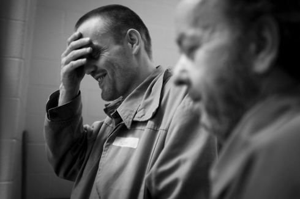

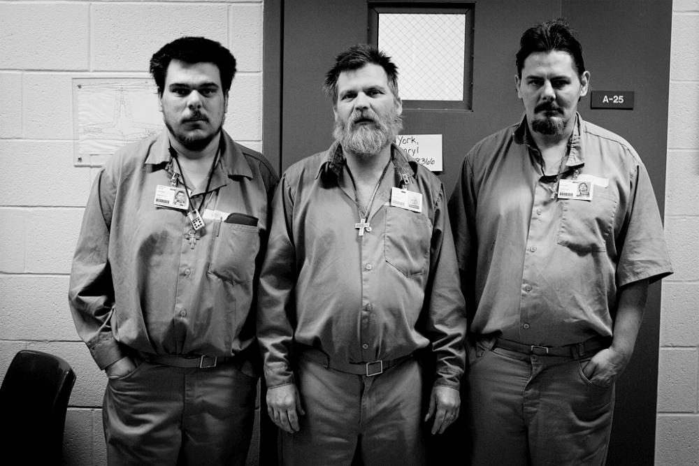

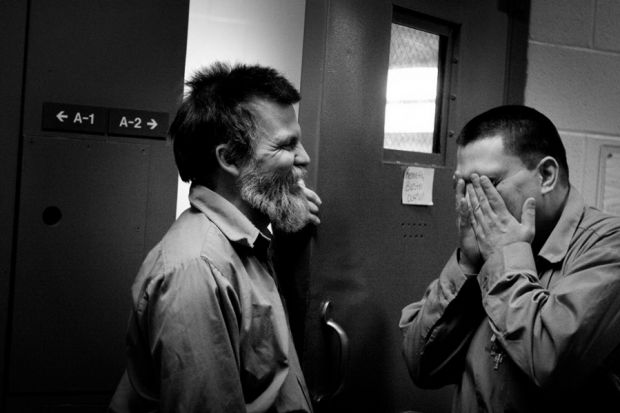

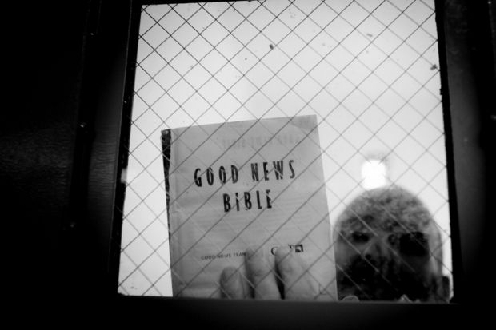

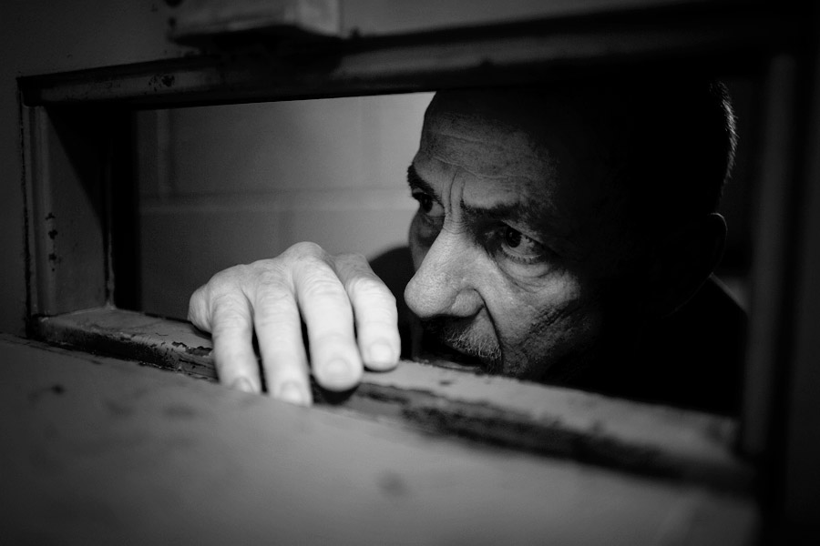

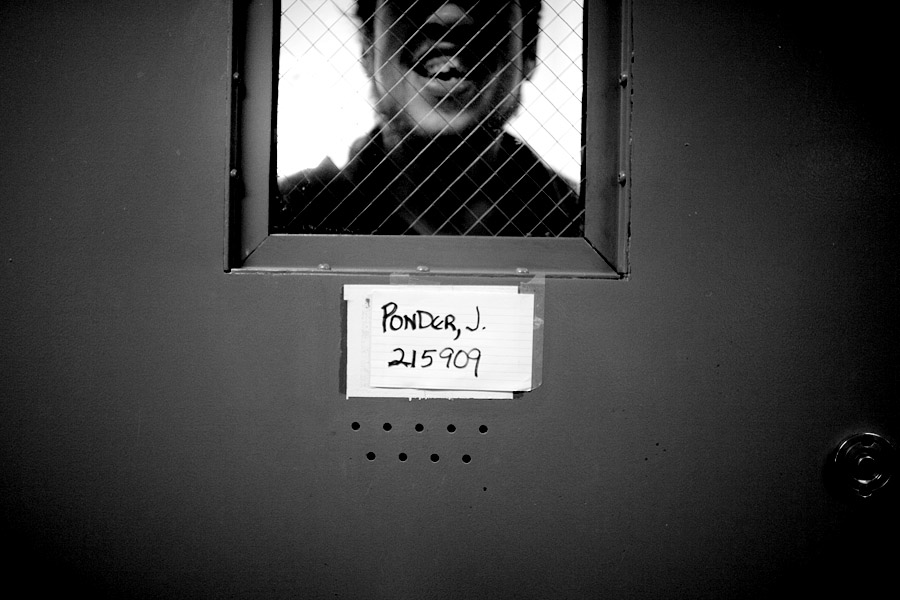

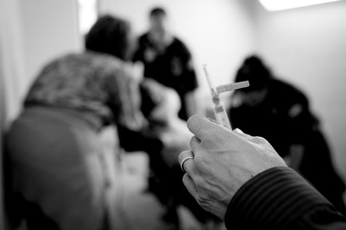

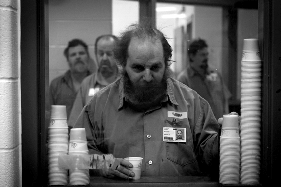

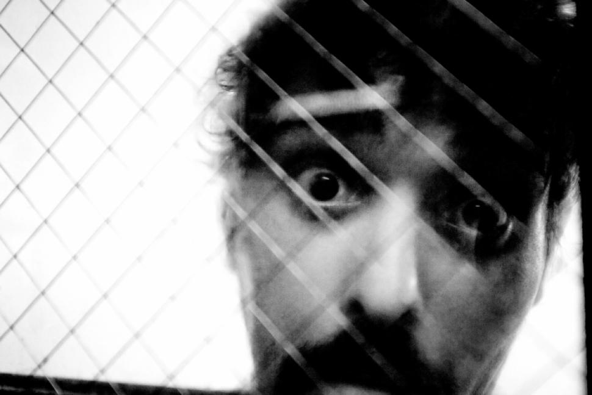

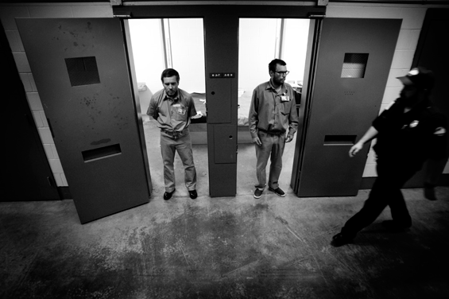

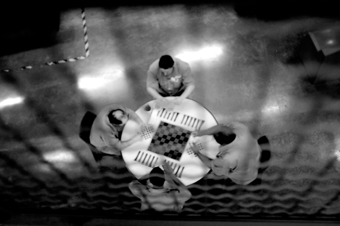

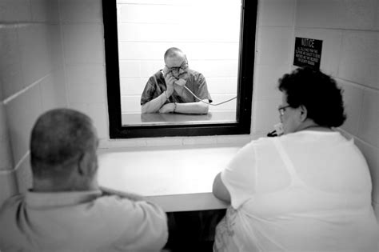

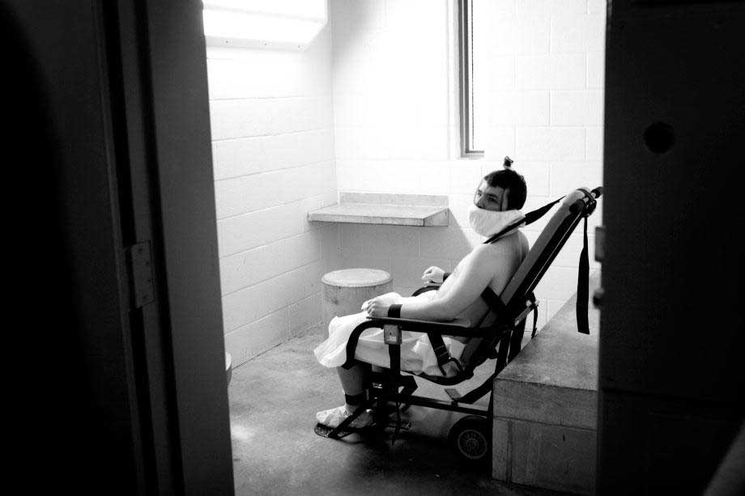

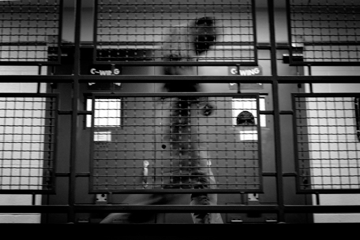

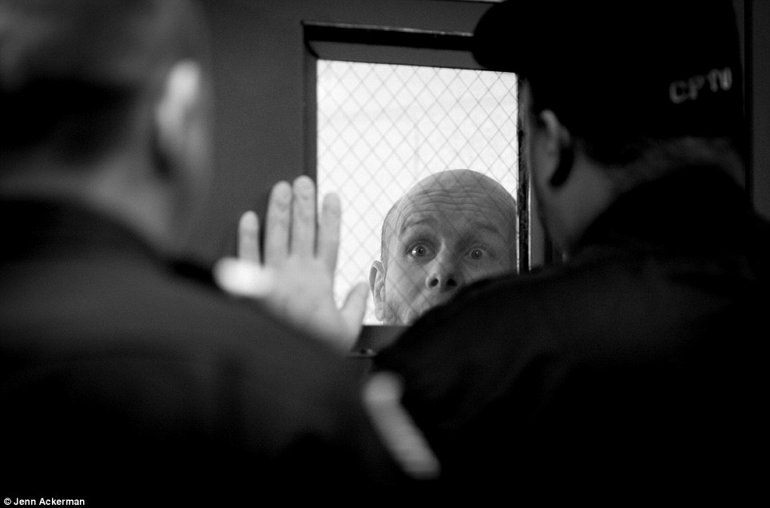

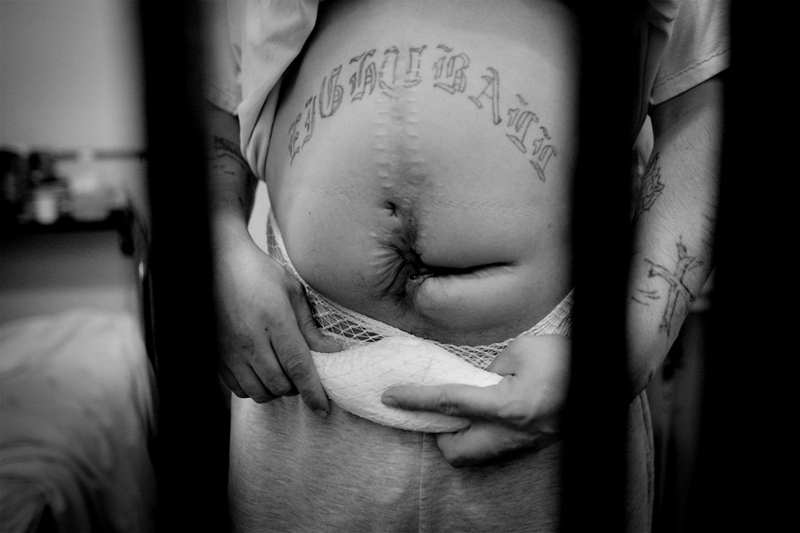

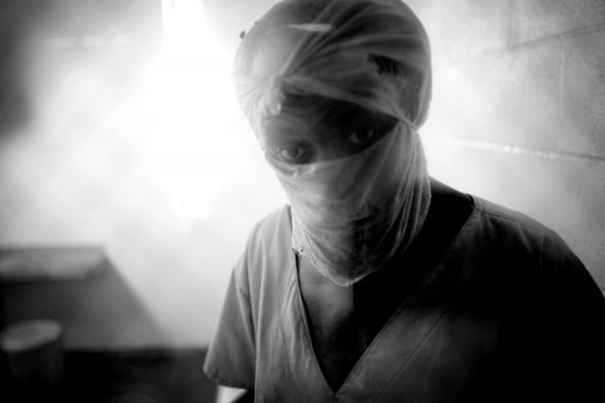

